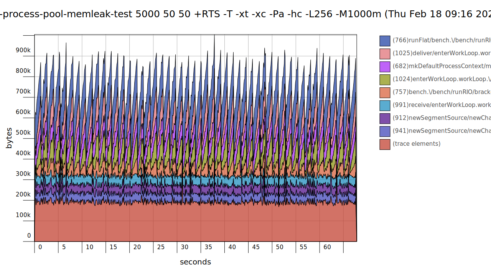

# Concurrent Process Pools

**NOTE:** To be able to fully view this README, use the [GitHub Pages Version](https://sheyll.github.io/rio-process-pool/).

* [API docs](./generated-reports/haddock-report/rio-process-pool)
* [API docs on Hackage](http://hackage.haskell.org/package/rio-process-pool)

A process pool processes incoming messages and dispatches them to worker threads.

Worker threads are started and stopped and each has their own message box, that decouples
from the processes for asynchronous processing.

The main architectural advantages are the usage of multiple CPU cores and the seperation of
address spaces of each worker.

This is clearly more low-level than STM in that regard, that STM offers 
shared memory concurrency.

This is also just a small library built on top of [unliftio-messagebox](https://sheyll.github.io/unliftio-messagebox/).

## Module Structure

The library is contained in modules with names starting with 
**RIO.ProcessPool**.

Also the module 
`RIO.ProcessPool` [(API docs)](./generated-reports/haddock-report/rio-process-pool/rio-process-pool.html)
[(Hackage)](http://hackage.haskell.org/package/rio-process-pool/docs/rio-process-pool.html)
exposes the API, and can be used to import everything.

The full documentation is either [on this page](./generated-reports/haddock-report/rio-process-pool/index.html)[(build log)](./generated-reports/haddock-report/build.log)
or on [Hackage](http://hackage.haskell.org/package/rio-process-pool).

## Benchmarks

* [Single Core Results](./generated-reports/benchmark-report/benchmark-1-CORES.html)
* [Multi Core Results](./generated-reports/benchmark-report/benchmark-ALL-CORES.html)

## Unit Tests

* [Test Results](./generated-reports/test-profiling-report/test-result.html)
* [Test Coverage](./generated-reports/test-coverage-report/hpc_index.html)
### Heap Profiling

### Time Profiling

[Test Profiling Report](./generated-reports/test-profiling-report/rio-process-pool-test.prof)

## Memory Leak Tests

Benchmark memory usage of a very simple `Pool` example.

A single dispatcher process sends a `Start`, some `Work` and a
`Stop` message to a `Pool` that spawns and dispatches the message

Like the previous benchmark this is a rather long running test 
executed with capped memory so that when space is leaked, it 
will crash the benchmark.

The output is printed into [this log file](./generated-reports/pool-memleak-test-report/test.log).
